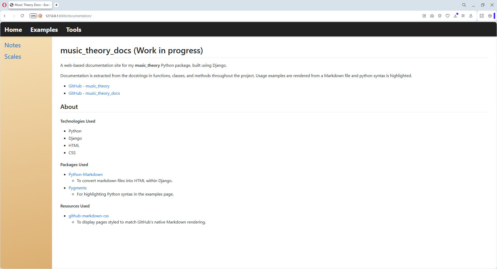
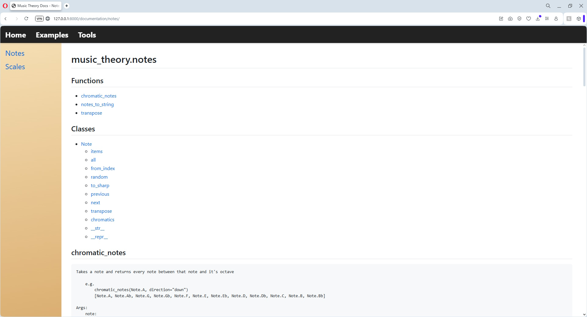

# music_theory_docs (Work in progress)
A web-based documentation site for my **music_theory** Python package, built using Django.

Documentation is extracted from the docstrings in functions, classes, and methods throughout the project. Usage examples are rendered from a Markdown file and python syntax is highlighted.

- <a href="https://craigmason19.github.io/music_theory_docs/index.html" target="_blank">Live documentation website</a>
- <a href="https://github.com/CraigMason19/music_theory" target="_blank">GitHub - music_theory</a>
- <a href="https://github.com/CraigMason19/music_theory_docs" target="_blank">GitHub - music_theory_docs</a>
 
## About

#### Technologies Used
- Python
- Django
- JavaScript
- HTML
- CSS

#### Packages Used
- [Python-Markdown](https://python-markdown.github.io)
    - To convert markdown files into HTML within Django.
- [Pygments](https://pygments.org)
    - For highlighting Python syntax in the examples page.

#### Resources Used
- [github-markdown-css](https://github.com/sindresorhus/github-markdown-css)
    - To display pages styled to match GitHub’s native Markdown rendering.

## Screenshots

